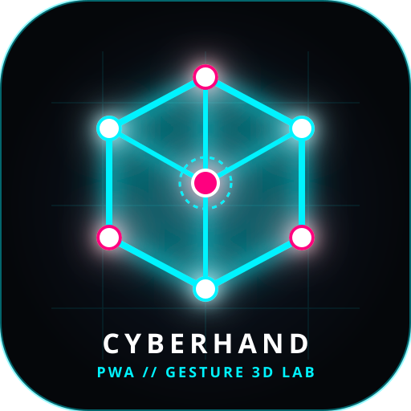

# ⚡ CYBERHAND // PWA de Manipulación 3D y Gestual con Visión Artificial



Una aplicación web progresiva (**PWA**) futurista de visión por computadora y realidad aumentada que permite rastrear las manos en tiempo real mediante la cámara web para **escribir en el aire**, **moldear y manipular objetos 3D y cubos sólidos**, y **controlar física de líneas y cuerdas elásticas con gestos**.

Desarrollada con **JavaScript (ES6+)**, **Google MediaPipe Hands**, **HTML5 Canvas 2D/3D**, y **Web Audio API**.

---

## 🚀 Características Principales

1. **✍️ Escribir en el Aire (Air Canvas):**
   * Levanta y apunta con tu dedo índice (☝️) para escribir y dibujar trazos de luz neón sobre la pantalla.
   * Mira láser interactiva y rastro de partículas en la yema de tu dedo.
   * Gesto de pellizco (👌) para agarrar y deformar trazos dibujados.
   * Botones de **Deshacer** y **Borrar**.

2. **🎲 Objeto 3D y Cubos Sólidos (Moldear & Manipular):**
   * Geometrías disponibles: **Cubo Subdividido**, **Esfera Geodésica**, **Torus (Donut)** y **Cristal Octaédrico**.
   * **3 Estilos de Render:**
     * **🧊 Sólido Opaco:** Caras sólidas 3D completas con cálculo de luz y sombras direccionales en tiempo real.
     * **💎 Cristal / Holograma:** Caras translúcidas iluminadas con aristas de neón brillantes.
     * **🕸️ Líneas:** Malla geométrica transparente de alambre (*wireframe*).
   * **Manipulación Gestual:**
     * **Mover:** Pellizco (👌) en el centro o con dos manos.
     * **Rotar en 3D:** Gira tu palma abierta (🖐️) o inclina las dos manos (👐).
     * **Estirar y Escalar:** Separa o junta las dos manos para agrandar o comprimir la figura.
     * **Moldear como Arcilla (Sculpting):** Pellizca cualquier vértice para deformar el objeto con decaimiento gaussiano.

3. **🎸 Hilos Elásticos (Quantum Harp):**
   * Cuerdas verticales con física de resortes (*Verlet Integration*) que vibran y producen notas de sintetizador al rozarlas con los dedos.
   * Red energética entre los dedos y arco de plasma entre ambas manos.

4. **🕸️ Malla Cuántica (Spacetime Grid):**
   * Red deformable que reacciona a la gravedad de los dedos y se puede estirar como goma.

5. **⚡ Rayos Láser & Singularidad:**
   * Dispara rayos desde las 5 yemas de los dedos.
   * Puño cerrado (✊) crea un agujero negro que absorbe todas las partículas y líneas hacia tu mano.

6. **📲 Soporte PWA Completo (Progressive Web App):**
   * `manifest.json` y `sw.js` (Service Worker) para instalación en escritorio y móviles.
   * Funciona como aplicación de escritorio nativa independiente (*standalone*).

7. **🔊 Sintetizador de Audio Procedural:**
   * Generación de sonido en tiempo real con Web Audio API (arpa láser, chasquidos de pellizco y sintetizador).

---

## 🛠️ Tecnologías y Lenguajes

* **JavaScript (ES6+)**: 100% de la lógica (cliente y servidor).
* **HTML5**: Estructura, acceso a cámara web (`getUserMedia`) y lienzo Canvas acelerado por GPU.
* **CSS3**: Estética cyberpunk, glassmorphism (`backdrop-filter`) y efectos neón.
* **Google MediaPipe Hands**: IA de visión artificial que detecta 21 articulaciones en 3D por mano a 60 FPS (ejecutado en WebAssembly).
* **Node.js**: Servidor HTTP local estático y liviano (`server.js`).

---

## 📦 Instalación y Uso Local

### 1. Clonar el repositorio:
```bash
git clone https://github.com/lealjesusalberto/render.git
cd render
```

### 2. Iniciar el servidor local:
```bash
node server.js
```
*(En Windows también puedes simplemente hacer doble clic en el archivo `start.bat`)*.

### 3. Abrir en el navegador:
Ingresa a **`http://localhost:3000`** y concede permiso a la cámara web.

---

## 📄 Licencia

Código abierto bajo la licencia MIT.
